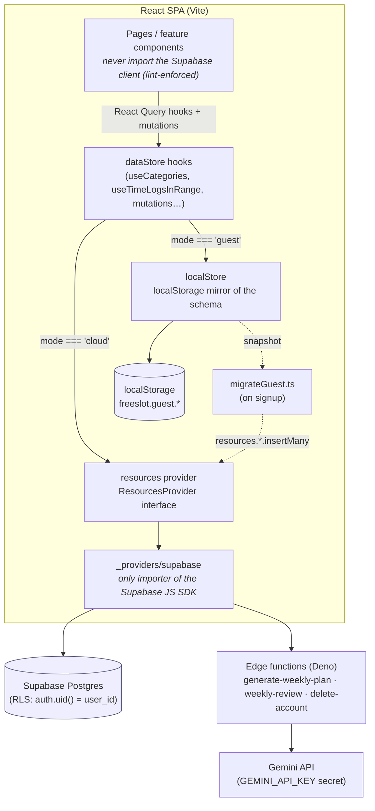
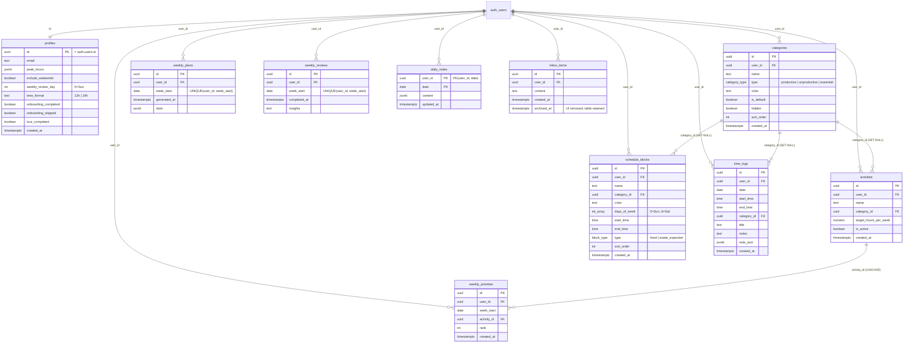

# Diagrams

Rendered visuals for FreeSlot's runtime data flow and its database schema. Both blocks are
[Mermaid](https://mermaid.js.org/) and render automatically on GitHub. Keep them in sync with
[`ARCHITECTURE.md`](./ARCHITECTURE.md) and [`src/resources/README.md`](../src/resources/README.md).

---

## 1. Data flow (guest vs. cloud)

How a read or write travels from a page down to storage. The key rule: pages and feature
components only ever touch `dataStore` hooks; `dataStore` is the single place that knows about the
guest/cloud split.

**Notes**

- The **AI planner** (`AIPlanPanel` → `generate-weekly-plan`) is cloud-only by design — it is the
  gated feature that incentivises signup, so it deliberately skips the guest branch.
- Guest reactivity comes from a `freeslot:guest-change` `CustomEvent` (plus the native `storage`
  event for cross-tab); `dataStore` hooks re-fetch on it.

---

## 2. Database ER schema

Every table is per-user and isolated by RLS (`auth.uid() = user_id`). `time_logs`, `schedule_blocks`,
and `activities` reference `categories` with `ON DELETE SET NULL`; `weekly_priorities` references
`activities` with `ON DELETE CASCADE`. `time_logs.type` (productive/unproductive/essential) is
**derived from its category at the app layer**, not stored as a column.

